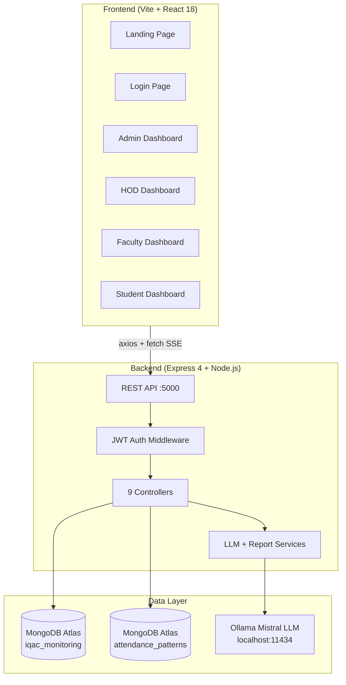
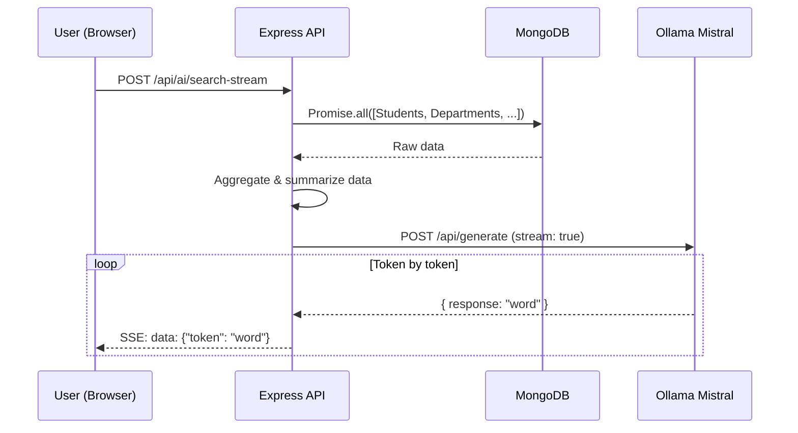
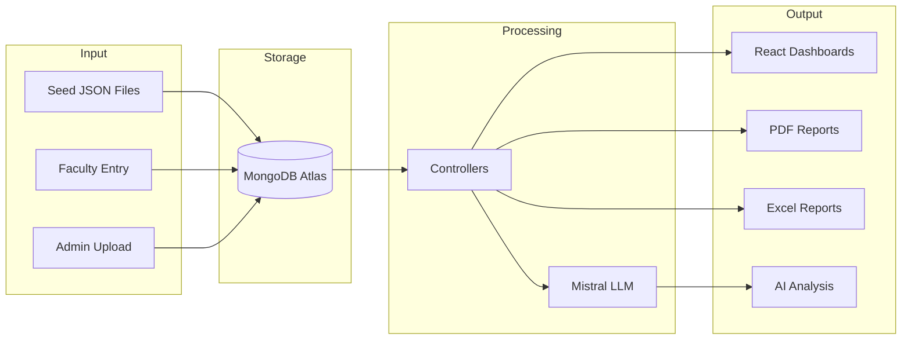

# AI-Powered IQAC Academic Intelligence & Accreditation Monitoring System

Full MERN project inside one workspace with:
- `frontend` (React + Tailwind + Chart.js)
- `backend` (Node + Express + MongoDB + JWT+LLM)

## Features Implemented

### Core Roles and Login
- Admin (IQAC), HOD, Faculty, Student roles
- JWT authentication
- Role-based route protection

### Academic Monitoring
- Student profile and semester-wise metrics
- CGPA trend, attendance pattern, backlog count
- Risk prediction engine (`LOW`, `MEDIUM`, `HIGH`)

### Department Monitoring
- Department creation and listing
- Department analytics (pass%, avg CGPA, backlog rate, placement rate)
- Placement and achievement data entry

### Faculty Inputs
- Upload marks
- Upload attendance
- Add research/publication records

### Accreditation Intelligence
- Store accreditation evidence for NAAC/NBA/AUDIT
- Filter by criterion/department/year/status
- Readiness score with missing items

### Automated Reports
- Report generation endpoint with PDF/Excel export
- Supported types:
  - Student Progress
  - Department Performance
  - CGPA Distribution
  - Backlog Analysis
  - Placement
  - Faculty Contribution
- Report history log

### Dashboard and Demo Flow
- Faculty Panel for marks and attendance upload
- Admin Dashboard with:
  - institutional analytics
  - department comparison chart
  - risk distribution chart
  - report download buttons
- Student dashboard with CGPA trend and risk badge

## Project Structure

```text
IQAC/
  backend/
    src/
      config/
      controllers/
      middleware/
      models/
      routes/
      services/
      utils/
  frontend/
    src/
      api/
      components/
      context/
      layouts/
      pages/
      styles/
```

## Setup

### 1) Backend

```bash
cd backend
npm install
```

Create `.env` using `.env.example` as template.

Update `.env`:

```env
PORT=5000
MONGO_URI=mongodb://127.0.0.1:27017/iqac_monitoring
JWT_SECRET=replace_with_strong_secret
JWT_EXPIRES_IN=1d
```

Run backend:

```bash
npm run dev
```

Seed demo data:

```bash
npm run seed
```

### 2) Frontend

```bash
cd frontend
npm install
npm run dev
```

Create `.env` using `.env.example` as template.

Frontend runs on `http://localhost:5173`.

## Demo Credentials (after seed)

Password for all:

```text
Admin@123
```

Users:
- Admin: `admin@iqac.edu`
- HOD: `hod.cse@iqac.edu`
- Faculty: `faculty.cse@iqac.edu`
- Student: `ravi@student.iqac.edu`

## Key API Endpoints

- `POST /api/auth/login`
- `POST /api/auth/register` (admin only)
- `GET /api/analytics/overview`
- `GET /api/analytics/department-comparison`
- `GET /api/analytics/risk-students?risk=HIGH`
- `POST /api/faculty/students/:studentId/marks`
- `POST /api/faculty/students/:studentId/attendance`
- `POST /api/reports/generate`
- `GET /api/accreditation/readiness?type=NAAC`

## Notes

- Frontend build is validated.
- Backend requires MongoDB connection configured in `.env`.
- This is a hackathon-ready foundation and can be extended with advanced ML models, notifications, and full audit trails.

# IQAC System — Complete Project Analysis

> AI-Powered Internal Quality Assurance Cell Academic Intelligence & Accreditation Monitoring System

---

## 1. High-Level Architecture



---

## 2. Technology Stack

| Layer | Technology | Version |
|-------|-----------|---------|
| **Runtime** | Node.js | 22.x |
| **Backend** | Express.js | 4.19 |
| **Frontend** | React | 18.3 |
| **Bundler** | Vite | 5.3 |
| **Styling** | TailwindCSS | 3.4 |
| **Database** | MongoDB Atlas (Mongoose 8.5) | — |
| **LLM** | Mistral via Ollama | local |
| **Auth** | JWT (jsonwebtoken) | 9.0 |
| **Charts** | Chart.js 4 + Recharts 3 | — |
| **PDF** | PDFKit | 0.15 |
| **Excel** | ExcelJS | 4.4 |
| **Security** | Helmet, bcryptjs, CORS | — |

---

## 3. Backend Architecture

### 3.1 Database Connections

Two separate MongoDB Atlas clusters managed via `mongoose.createConnection()`:

| Connection | Database | Purpose |
|-----------|----------|---------|
| `mainDB` | `iqac_monitoring` | All core data (students, marks, departments, etc.) |
| `attendanceDB` | `attendance_patterns` | Secondary attendance pattern analysis |

### 3.2 Models (18 Mongoose Schemas)

| Model | Key Fields | Relationships |
|-------|-----------|---------------|
| [Student](file:///d:/AI%20SYSTEM%20HACKTHON%2014-3-26/IQAC/backend/src/models/Student.js) | `rollNo`, [name](file:///d:/AI%20SYSTEM%20HACKTHON%2014-3-26/IQAC/backend/generate_data.py#40-42), `email`, `currentSemester`, `batch`, `riskLevel`, `metrics[]` (semester SGPA/CGPA/backlogs/attendance), `feeDetails` | → Department |
| [Department](file:///d:/AI%20SYSTEM%20HACKTHON%2014-3-26/IQAC/backend/src/models/Department.js) | [name](file:///d:/AI%20SYSTEM%20HACKTHON%2014-3-26/IQAC/backend/generate_data.py#40-42), `code`, `vision`, `mission` | → User (HOD) |
| [User](file:///d:/AI%20SYSTEM%20HACKTHON%2014-3-26/IQAC/backend/src/models/User.js) | [name](file:///d:/AI%20SYSTEM%20HACKTHON%2014-3-26/IQAC/backend/generate_data.py#40-42), `email`, `password`, `role` (admin/hod/faculty/student), `facultyProfile`, `registrationNumber` | → Department, → Student |
| [Mark](file:///d:/AI%20SYSTEM%20HACKTHON%2014-3-26/IQAC/backend/src/models/Mark.js) | `subjectCode`, `subjectName`, `semester`, `internal`, `external`, `total`, `passed` | → Student, → User (faculty), → Section |
| [Attendance](file:///d:/AI%20SYSTEM%20HACKTHON%2014-3-26/IQAC/backend/src/models/Attendance.js) | `semester`, `academicYear`, `totalClasses`, `attendedClasses`, `percentage`, `subjects[]` | → Student, → User |
| [Placement](file:///d:/AI%20SYSTEM%20HACKTHON%2014-3-26/IQAC/backend/src/models/Placement.js) | `academicYear`, `totalEligible`, `totalPlaced`, `highestPackageLPA`, `medianPackageLPA`, `majorRecruiters[]` | → Department |
| [Research](file:///d:/AI%20SYSTEM%20HACKTHON%2014-3-26/IQAC/backend/src/models/Research.js) | `title`, `publicationType` (Journal/Conference/Patent/Book Chapter), `journalOrConference`, `publishedOn` | → Department, → User (faculty) |
| [AccreditationItem](file:///d:/AI%20SYSTEM%20HACKTHON%2014-3-26/IQAC/backend/src/models/AccreditationItem.js) | `title`, `body`, `type` (NAAC/NBA/AUDIT), `criterion`, `completed`, `evidenceUrl` | → Department, → User |
| [Achievement](file:///d:/AI%20SYSTEM%20HACKTHON%2014-3-26/IQAC/backend/src/models/Achievement.js) | `title`, `category` (Faculty/Student/Department), `level` (Institute/State/National/International) | → Department |
| [ReportLog](file:///d:/AI%20SYSTEM%20HACKTHON%2014-3-26/IQAC/backend/src/models/ReportLog.js) | `reportType`, `format` (PDF/EXCEL), `filters` | → User |
| Section | Section management | → Department |
| DepartmentStat | Department statistics | → Department |
| Faculty | Faculty-specific data | — |
| FacultyAchievement | Faculty achievement records | — |
| StudentAchievement | Student achievement records | — |
| StudentActivity | Student event participation | — |
| TeachingAssignment | Teaching load tracking | — |
| Announcement | System announcements | — |

### 3.3 API Routes (9 Route Files, ~50+ Endpoints)

| Route File | Base Path | Auth | Key Endpoints |
|-----------|-----------|------|---------------|
| [authRoutes](file:///d:/AI%20SYSTEM%20HACKTHON%2014-3-26/IQAC/backend/src/routes/authRoutes.js) | `/api/auth` | Public + Protected | `POST /login`, `POST /public-signup`, `GET /me` |
| [studentRoutes](file:///d:/AI%20SYSTEM%20HACKTHON%2014-3-26/IQAC/backend/src/routes/studentRoutes.js) | `/api/students` | admin, hod | CRUD, filters, dashboard, metrics |
| [departmentRoutes](file:///d:/AI%20SYSTEM%20HACKTHON%2014-3-26/IQAC/backend/src/routes/departmentRoutes.js) | `/api/departments` | admin, hod | CRUD, analytics, placements, achievements |
| [facultyRoutes](file:///d:/AI%20SYSTEM%20HACKTHON%2014-3-26/IQAC/backend/src/routes/facultyRoutes.js) | `/api/faculty` | faculty, hod | Marks upload, attendance, research |
| [analyticsRoutes](file:///d:/AI%20SYSTEM%20HACKTHON%2014-3-26/IQAC/backend/src/routes/analyticsRoutes.js) | `/api/analytics` | admin, hod, faculty | Overview, department comparison, risk students |
| [reportRoutes](file:///d:/AI%20SYSTEM%20HACKTHON%2014-3-26/IQAC/backend/src/routes/reportRoutes.js) | `/api/reports` | admin, hod | Generate PDF/Excel, history |
| [accreditationRoutes](file:///d:/AI%20SYSTEM%20HACKTHON%2014-3-26/IQAC/backend/src/routes/accreditationRoutes.js) | `/api/accreditation` | admin, hod | Items CRUD, readiness score |
| [aiRoutes](file:///d:/AI%20SYSTEM%20HACKTHON%2014-3-26/IQAC/backend/src/routes/aiRoutes.js) | `/api/ai` | admin, hod, faculty | 8 AI jobs + streaming search |
| [adminRoutes](file:///d:/AI%20SYSTEM%20HACKTHON%2014-3-26/IQAC/backend/src/routes/adminRoutes.js) | `/api/admin` | admin | User management |

### 3.4 Controllers (9 Files)

| Controller | Purpose |
|-----------|---------|
| [authController](file:///d:/AI%20SYSTEM%20HACKTHON%2014-3-26/IQAC/backend/src/controllers/authController.js) | Login, signup, JWT token generation, `GET /me` |
| [studentController](file:///d:/AI%20SYSTEM%20HACKTHON%2014-3-26/IQAC/backend/src/controllers/studentController.js) | Student CRUD, dashboard data, semester metrics, filtering |
| [departmentController](file:///d:/AI%20SYSTEM%20HACKTHON%2014-3-26/IQAC/backend/src/controllers/departmentController.js) | Department CRUD, analytics, placement data, achievements |
| [facultyController](file:///d:/AI%20SYSTEM%20HACKTHON%2014-3-26/IQAC/backend/src/controllers/facultyController.js) | Marks entry, attendance tracking, research publication management |
| [analyticsController](file:///d:/AI%20SYSTEM%20HACKTHON%2014-3-26/IQAC/backend/src/controllers/analyticsController.js) | KPI overview, department ranking, risk distribution |
| [reportController](file:///d:/AI%20SYSTEM%20HACKTHON%2014-3-26/IQAC/backend/src/controllers/reportController.js) | PDF/Excel report generation, report history logging |
| [accreditationController](file:///d:/AI%20SYSTEM%20HACKTHON%2014-3-26/IQAC/backend/src/controllers/accreditationController.js) | NBA/NAAC accreditation item management, readiness calculation |
| [aiController](file:///d:/AI%20SYSTEM%20HACKTHON%2014-3-26/IQAC/backend/src/controllers/aiController.js) | All 8 AI report controllers + streaming SSE search |
| [adminController](file:///d:/AI%20SYSTEM%20HACKTHON%2014-3-26/IQAC/backend/src/controllers/adminController.js) | User management (admin-only) |

### 3.5 Services (2 Files)

| Service | Purpose | Key Features |
|---------|---------|-------------|
| [llmService](file:///d:/AI%20SYSTEM%20HACKTHON%2014-3-26/IQAC/backend/src/services/llmService.js) | All Mistral LLM interactions | 8 specialized prompt functions + NL query, in-memory cache (5 min TTL), `num_predict:80-200`, `temperature:0.3` |
| [reportService](file:///d:/AI%20SYSTEM%20HACKTHON%2014-3-26/IQAC/backend/src/services/reportService.js) | PDF and Excel file generation | PDFKit for PDF, ExcelJS for Excel spreadsheets |

### 3.6 Security & Middleware

| Component | Implementation |
|-----------|---------------|
| **Authentication** | JWT Bearer tokens via [protect()](file:///d:/AI%20SYSTEM%20HACKTHON%2014-3-26/IQAC/backend/src/middleware/authMiddleware.js#4-25) middleware |
| **Authorization** | Role-based via [authorize("admin","hod",...)](file:///d:/AI%20SYSTEM%20HACKTHON%2014-3-26/IQAC/backend/src/middleware/authMiddleware.js#26-36) — 4 roles: admin, hod, faculty, student |
| **Password Hashing** | bcryptjs with salt round 10 |
| **Security Headers** | Helmet.js |
| **CORS** | Open CORS for dev |
| **Request Logging** | Morgan (dev format) |
| **Error Handling** | `express-async-errors` + global error handler |
| **Body Limit** | 5 MB JSON limit |

---

## 4. LLM Integration (Mistral via Ollama)

### 4.1 Architecture



### 4.2 The 8 AI Jobs

| Job | Function | Input Data | Output |
|-----|----------|-----------|--------|
| 1 | Student Progress Analysis | Risk levels, CGPA, attendance, backlogs | 4-sentence formal analysis |
| 2 | Department Performance | Dept scores, CGPA, pass%, placement% | NBA compliance assessment |
| 3 | CGPA Distribution | Distribution bands, NBA threshold | 3-sentence pattern analysis (cached) |
| 4 | Backlog Analysis | Clean pass rate, worst dept/semester | Severity + intervention plan |
| 5 | Placement Forecast | Placement rates, packages, recruiters | Trend forecast + recommendations |
| 6 | Faculty Contribution | Publications, types, per-faculty ratio | NBA Criterion 4 compliance |
| 7 | Accreditation Readiness | NBA/NAAC scores, missing items | Audit readiness verdict (cached) |
| 8 | Natural Language Search | Full DB summary as context | 2-sentence factual answer |

### 4.3 Performance Optimizations Applied

| Optimization | Impact |
|-------------|--------|
| `num_predict: 80-200` tokens | Forces short, fast responses |
| `temperature: 0.3` | Consistent, focused output |
| `Promise.all()` for DB queries | 3-5x faster data loading |
| `.lean()` on all Mongoose queries | Plain JS objects — no Mongoose overhead |
| In-memory cache (5 min TTL) | Instant repeat queries for Jobs 3 & 7 |
| SSE streaming for search | First word appears in 1-2 seconds |
| Short prompts (~500 chars) | Reduced prompt processing time |

---

## 5. Frontend Architecture

### 5.1 Routing & Role-Based Access

| Route | Page | Allowed Roles |
|-------|------|---------------|
| `/` | Landing Page | Public |
| `/auth` | Login Page | Public |
| `/home` | Home Page | All authenticated |
| `/admin` | Admin Dashboard | admin |
| `/hod` | HOD Dashboard | hod |
| `/faculty` | Faculty Dashboard | faculty, hod, admin |
| `/student` | Student Dashboard | student |

### 5.2 Pages (8)

| Page | Key Features |
|------|-------------|
| [LandingPage](file:///d:/AI%20SYSTEM%20HACKTHON%2014-3-26/IQAC/frontend/src/pages/LandingPage.jsx) | Public intro page |
| [LoginPage](file:///d:/AI%20SYSTEM%20HACKTHON%2014-3-26/IQAC/frontend/src/pages/LoginPage.jsx) | Email/password login form |
| [AdminDashboard](file:///d:/AI%20SYSTEM%20HACKTHON%2014-3-26/IQAC/frontend/src/pages/AdminDashboard.jsx) | KPI cards, charts, AI search (streaming), report generation |
| [HodDashboard](file:///d:/AI%20SYSTEM%20HACKTHON%2014-3-26/IQAC/frontend/src/pages/HodDashboard.jsx) | Department-scoped analytics |
| [FacultyDashboard](file:///d:/AI%20SYSTEM%20HACKTHON%2014-3-26/IQAC/frontend/src/pages/FacultyDashboard.jsx) | Marks/attendance entry, research |
| [StudentDashboard](file:///d:/AI%20SYSTEM%20HACKTHON%2014-3-26/IQAC/frontend/src/pages/StudentDashboard.jsx) | Personal performance view |
| [HomePage](file:///d:/AI%20SYSTEM%20HACKTHON%2014-3-26/IQAC/frontend/src/pages/HomePage.jsx) | Role-based landing |
| [NotFoundPage](file:///d:/AI%20SYSTEM%20HACKTHON%2014-3-26/IQAC/frontend/src/pages/NotFoundPage.jsx) | 404 handler |

### 5.3 Components (21)

- **Charts**: `DepartmentChart`, `DepartmentComparisonChart`, `RiskChart`, `RiskDistributionChart`, `RiskDoughnut`, `SectionComparisonChart`, `SectionPerformanceChart`, `FacultyRiskChart`, `SafeChartContainer`
- **UI**: `StatCard`, `StatsCards`, `FacultyStatsCards`, `TopStudentsTable`, `Sidebar`, `AdminSidebar`, `FacultySidebar`
- **Management**: `AddFacultyDrawer`, `AttendanceManager`, `FacultyAchievements`, `FacultyProfile`
- **Auth**: `ProtectedRoute`

---

## 6. Data Flow Summary



---

## 7. Database Statistics (Live)

| Collection | Count |
|-----------|-------|
| Students | 90 |
| Departments | 3 (CSE, ECE, MECH) |
| Users | Multiple (admin, hod, faculty, student roles) |
| Marks | Per-student per-subject records |
| Placements | Per-department per-year |
| Research | Faculty publications |
| AccreditationItems | NBA + NAAC criteria |

---

## 8. Test Coverage

A comprehensive 13-suite, 76-test test suite exists at [testAll.js](file:///d:/AI%20SYSTEM%20HACKTHON%2014-3-26/IQAC/backend/src/utils/testAll.js):

| Suite | Tests | Coverage |
|-------|-------|----------|
| Pre-flight Checks | 7 | Server, DB, Ollama health |
| Authentication | 9 | Login, signup, JWT, roles |
| Student API | 6 | CRUD, filters, dashboard |
| Department API | 3 | CRUD, analytics, placements |
| Analytics API | 5 | KPIs, comparison, risk |
| Accreditation API | 5 | Items, readiness, filters |
| LLM Data Aggregation | 8 | Data pipeline verification |
| LLM Job Tests | 14 | All 8 Mistral jobs |
| LLM Accuracy | 5 | Answers match DB values |
| Cache Tests | 3 | Set/get/clear verification |
| Load Tests | 1 | Sequential performance |
| NL Search | 10 | Natural language questions |
| Security | 2 | Role enforcement |

**Last run result: 75/76 passed (99% success rate)**

---

## 9. Environment Configuration

| Variable | Purpose |
|----------|---------|
| `PORT` | Backend port (5000) |
| `MONGO_URI` | Main database connection |
| `DB_PASSWORD` | MongoDB Atlas password |
| `ATTENDANCE_MONGO_URI` | Secondary attendance DB |
| `JWT_SECRET` | Token signing secret |
| `JWT_EXPIRES_IN` | Token expiry (1 day) |

---

## 10. Key Project Strengths

1. **Full-stack MERN** with clean separation of concerns
2. **Role-based access control** at route, controller, and frontend level
3. **Real LLM integration** with Mistral for intelligent analysis
4. **Live SSE streaming** for responsive AI search
5. **NBA/NAAC accreditation tracking** with readiness scoring
6. **Multi-format report generation** (PDF + Excel)
7. **Comprehensive test suite** with 76 tests across 13 categories
8. **Performance-optimized** DB queries with `Promise.all()` and `.lean()`
9. **In-memory caching** for expensive LLM calls
10. **Dual database architecture** for specialized data stores

## 11. Areas for Improvement

| Area | Current State | Recommendation |
|------|--------------|----------------|
| **LLM Speed** | 15-20s per query (local Mistral) | Use cloud GPU or smaller model (e.g., `mistral:7b-instruct-v0.2-q4_0`) |
| **JWT Secret** | Hardcoded weak value | Generate a strong random secret |
| **Error Logging** | Console-only | Add structured logging (Winston/Pino) |
| **API Pagination** | Missing on list endpoints | Add `?page=&limit=` to student/mark queries |
| **Input Validation** | Basic Mongoose validation | Add express-validator for request body |
| **File Uploads** | No evidence file upload | Add multer for accreditation evidence docs |
| **Rate Limiting** | None | Add express-rate-limit for AI endpoints |
| **Test Automation** | Manual `node` command | Add to CI/CD pipeline |
